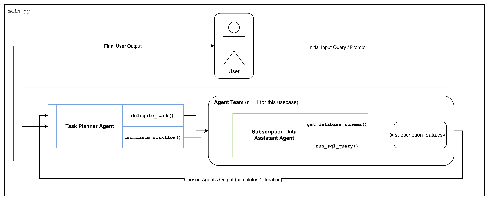

# Cohere Forward Deployed Engineer Assessment

## 🚀 Overview

This repository contains an Agentic AI solution designed to answer complex sales and business queries based on subscription data.



The system implements a **Supervisor-Worker (Hierarchical) Architecture** to ensure accuracy, safety, and scalability:

1. **Task Planner (Supervisor):** A strategic agent that handles high-level reasoning, business logic interpretation (e.g., defining "Churn Risk"), and strictly enforces PII (Personally Identifiable Information) safety protocols.
2. **Data Analyst (Worker):** A specialized execution agent restricted to SQL operations on an in-memory SQLite database. This ensures secure, deterministic data retrieval without hallucinating schema details. This was also chosen to show compatibility with
more scaleable data such as external databses.

---

## 📂 Project Structure

```text
tech_assessment_FDE/
├── config/                 # Prompt templates and tool configurations
│   ├── agent_config.py     # System prompts for Planner & Analyst
│   └── tools_config.py     # JSON schemas for Cohere API
├── data/                   # Data inputs
│   ├── evaluation_data.json      # Test cases (Questions + Golden Answers)
│   └── subscription_data.csv     # Raw subscription dataset
├── reports/                # Generated Artifacts (Created on runtime)
│   ├── evaluation_report.md      # Summary report of the last evaluation run
│   └── evaluation_report.csv     # Raw row-level data for debugging
├── src/                    # Source Code
│   ├── agents/             # Agent logic (Planner & Data Analyst)
│   ├── tools/              # SQLite Store & Tool implementations
│   └── agent_team.py       # Registry for managing agent discovery
├── evaluate.py             # Evaluation pipeline script (LLM-as-a-Judge)
├── main.py                 # Interactive CLI for testing the agent
└── requirements.txt        # Python dependencies

```

---

## 🛠️ Setup & Installation

**Prerequisites:** Python 3.9+

1. **Clone the repository:**
```bash
git clone <repo_url>
cd tech_assessment_FDE

```


2. **Create a virtual environment:**
```bash
python -m venv venv
# Activate on macOS/Linux:
source venv/bin/activate
# Activate on Windows:
venv\Scripts\activate

```


3. **Install dependencies:**
```bash
pip install -r requirements.txt

```


4. **Configure Environment Variables:**
Create a `.env` file in the root directory and add your Cohere API key (below). See `env.template` for an example.

```text
COHERE_API_KEY=your_api_key_here
DEBUG_MODE=False  # Set to True for verbose agent logs

```


---

## 🖥️ Usage

### 1. Interactive CLI (Manual Testing)

Run the agent team in an interactive loop to test specific queries manually.

```bash
python main.py

```

* **Type your query** (e.g., "Which customers are at risk of churning?").
* **Type `-1`** to exit the session.

### 2. Run Evaluation Pipeline (Automated Testing)

Execute the comprehensive test suite. This script uses an **LLM-as-a-Judge** approach to grade the agent's performance against `data/evaluation_data.json`.

```bash
python evaluate.py

```

**Key Features of Evaluation:**

* **Consistency Check:** Each question is run **3 times** to measure stability.
* **Dual Scoring:** Answers are graded on both **Correctness** (0/1) and **Quality** (0-5).
* **Rate Limit Handling:** The pipeline automatically handles `429` errors by pausing execution.

---

## 📊 Evaluation Artifacts

After running `evaluate.py`, check the `reports/` folder:

* **`evaluation_report.md`**: A clean, readable summary of Pass/Fail rates, Quality scores, and failure reasoning.
* **`evaluation_report.csv`**: A detailed dataset containing every replication, duration metrics, and full judge reasoning. Use this for deep-dive analysis.

---
Please refer to `FINDINGS.md` for a detailed report regarding the prompt engineering approach, evaluation design, metrics and iteration details.
